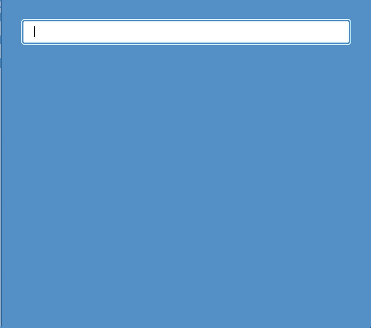

# TypeAhead Component



## Table of Contents

- [Prerequisites](#pre_reqs)
- [Getting Started](#getting_started)
- [Functional Requirements](#func_reqs)

### Prerequisites <a name = "prereqs"></a>

If you do not already have `serve` installed globally, you will need to install it before running the project. Do so by running:

```bash
  npm install -g serve
```

## Getting Started <a name = "getting_started"></a>

To get this project started on your local machine:

1. In the root folder of the project, run:

```bash
npm install
```

4. Build the app and deploy it on your local machine by running:

```bash
npm run deploy
```

## Functional Requirements <a name = "func_reqs"></a>

1. As the user types in the input field, a list of options should appear below it.
   - The typeahead component uses a handler listening for the input elements `change` event to accomplish this.
2. Clicking on a list item should populate the input with the selected item's value and hide the list.

   - The typeahead component uses a callback passed into the `SuggestionMenu` component to accomplish this.

3. As the user types, the matching substring within the dipslayed options should be bold. The rest of the string should not be bold.
   1. Ex. When the user types `bl`, `bl` in `black`, `blanchedalmond`, `blue`, and `blueviolet` should be bold. The rest of each word should not be bold.
      - The typeahead component uses a prefix tree to calculate the correct suggestions. In a production setting, a robust searching package/solution would likely be used to accomplish this.
4. Mousing over a list item should highlight it, at least darkening its background color. Other styling is up to you.

   - I used `styled-components` to style the base components, including psuedo-classes and psuedo-elements.

5. The input and list should also be navigable using the keyboard.

   - The typeahead component uses HTML tab indices to accomplish navigation via `tab` and `shift`+`tab`. For the behavior specificied for the `esc` and `enter`/`return` keys, a keyboard event handler was used in combination with a `react` ref object to programmatically focus the input.

6. Clicking outside the input or the list should close the list.

   - To accomplish this, a hook was used which adds event listeners to the document to listen for clicks which fall outside the ref object provided to the hook.
